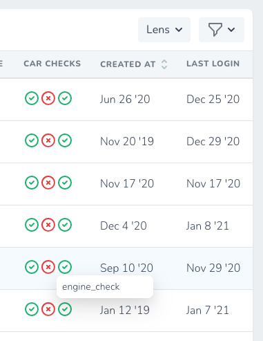
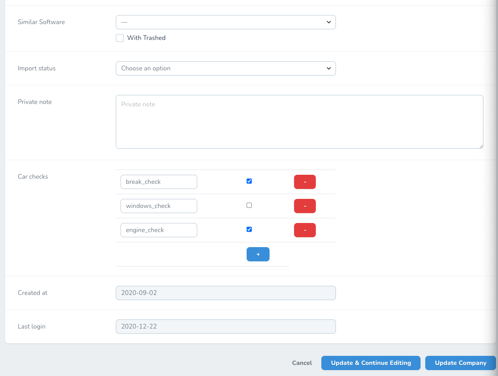

# Nova Boolean multi status Field

This field allow to store/display multiple boolean values within 1 array/object.
Usually it is stored as json, but that depends on a Eloquent model implementation. 

Field accepts both array and object values.
If the data is an object, keys will be displayd as tooltips (on hover)

[Boolean multi status repository](https://github.com/jankapusta/nova-boolean-multi-status-field)





## Installation

You can install the package in to a Laravel app that uses [Nova](https://nova.laravel.com) via composer:

```bash
composer require jankapusta/nova-boolean-multi-status-field
```

## Usage

Laravel migration example:

```php
$table->json('car_multi_status');
```


Laravel model example

```php
class Car extends Model {
    protected $casts = [
        'car_multi_status' => 'array',
    ];
    // ....
}

Car::create([
    'car_multi_status' => [
      'break_check' => true,
      'windows_check' => false,
      'engine_check' => true,
    ],
]);

```

Then add a field into Nova Resource

```php
BooleanMultiStatus::make('Car checks', 'car_multi_status')
// optional configuration
  ->showKeysAsTooltips(false)
  ->widt(80), // in pixels
```

## License

The MIT License (MIT). Please see [License File](LICENSE.md) for more information.